## INTRO TO DESCRIPTIVE STATISTICS

Correlation does not mean causation:
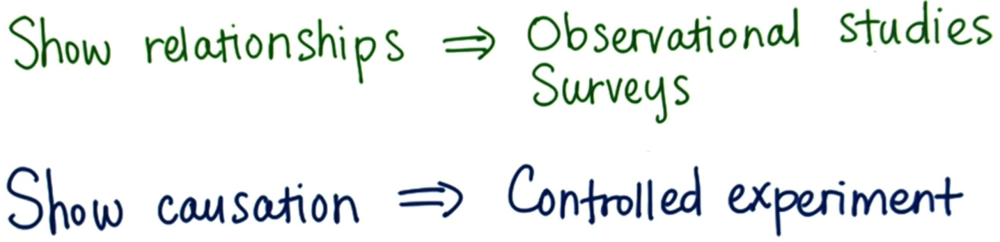

A number that describes a **sample** is called a **statistic**. 
A number that describes a **population** is called a **parameter**.

In an experiment, the researcher manipulates the **independent** variable, measures changes in the **dependent** variable, and seeks to control **lurking** variables.

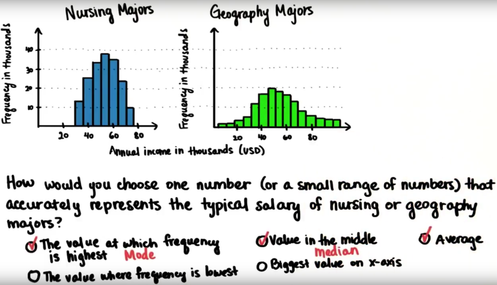

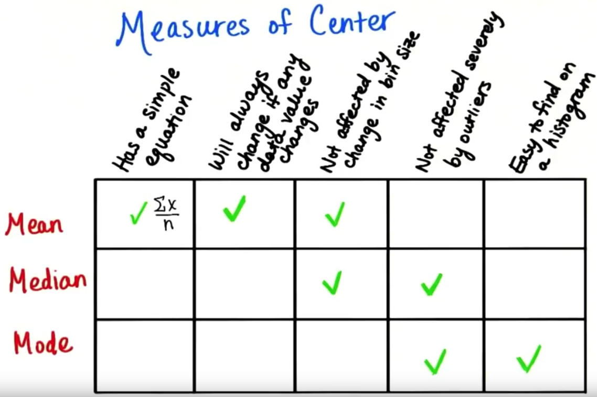

#### Standard Deviation:
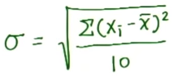

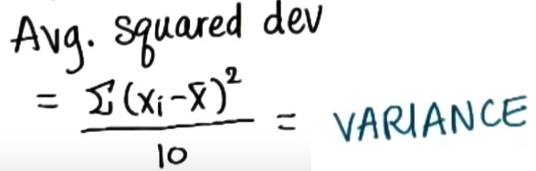

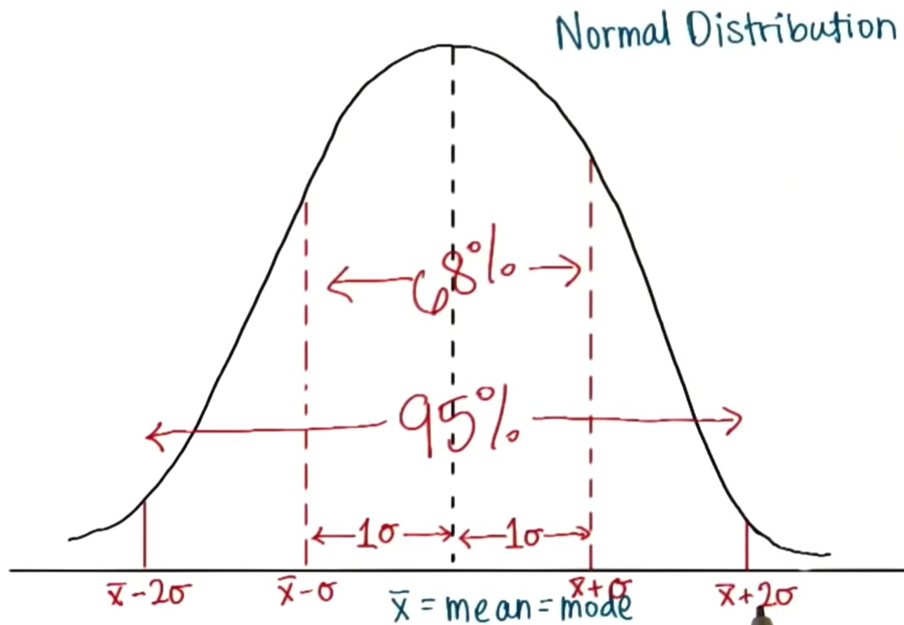

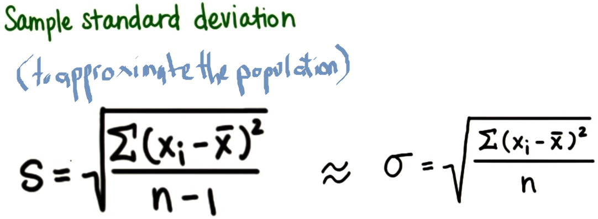

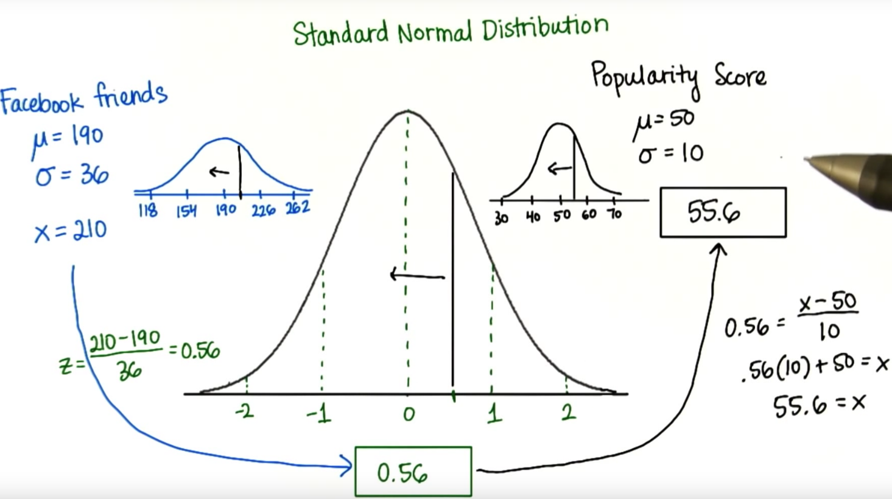

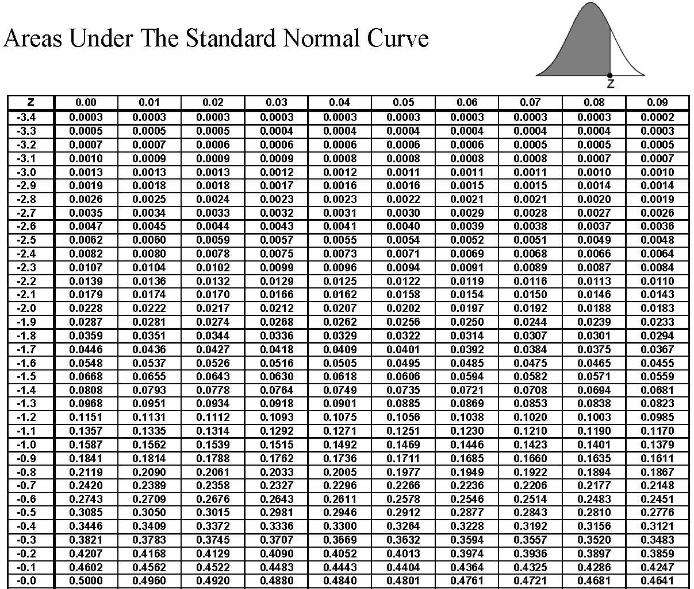
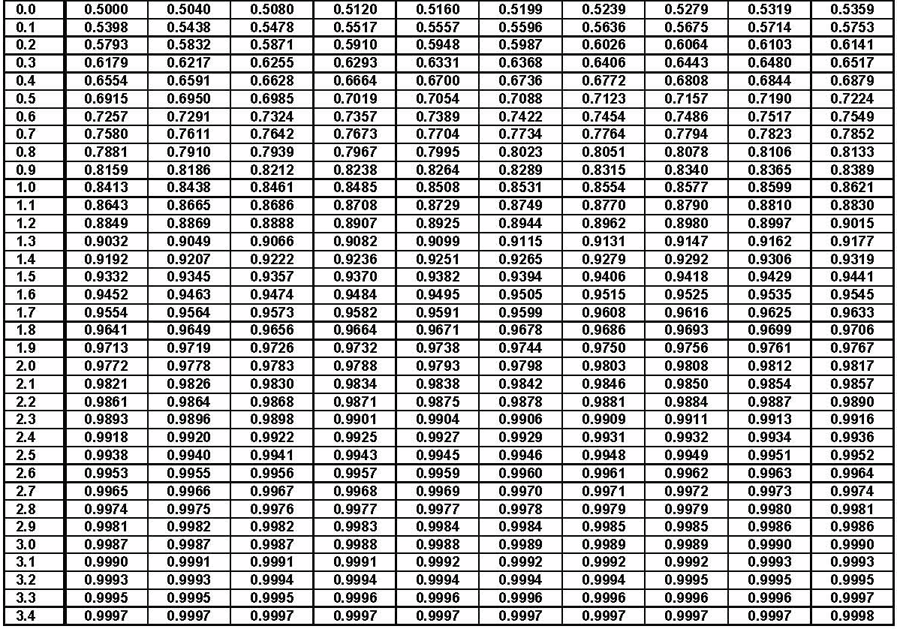

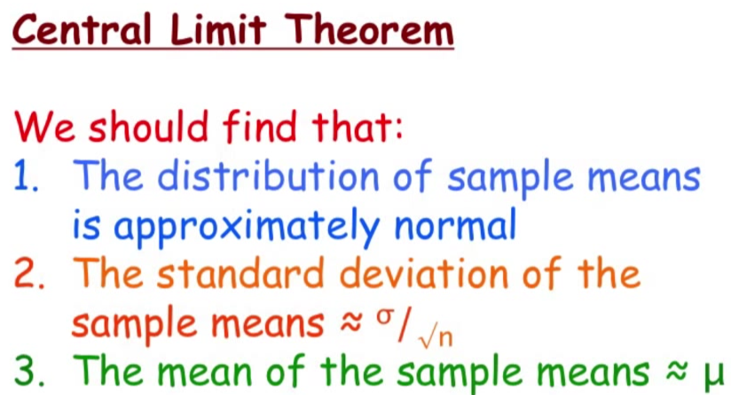
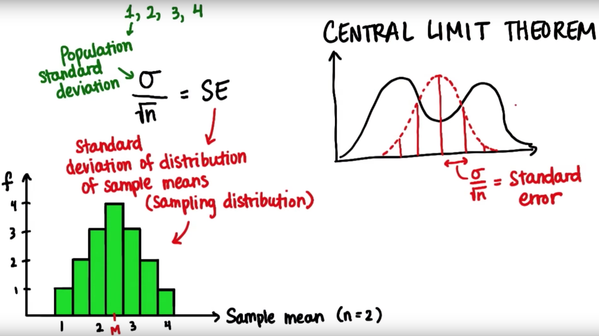

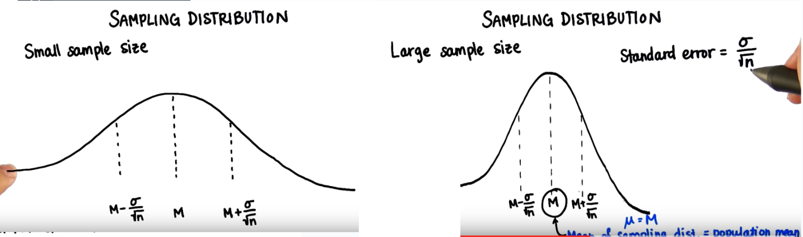
http://onlinestatbook.com/stat_sim/sampling_dist/index.html